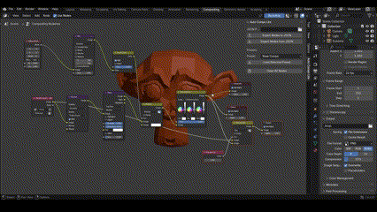

# Auto Compo Lite: A Compositing Companion for Artists and Developers

**Auto Compo Lite is a lightweight Blender add-on that simplifies and speeds up the compositing workflow. It allows users to instantly set up common post-processing effects such as glare, vignette, and color correction. In addition, it provides export and import of full node setups as reusable JSON templates, enabling artists and developers to efficiently share, version, and manage their compositing workflows across multiple Blender projects**

## Interface

**Render Properties > Auto Compo Lite**

